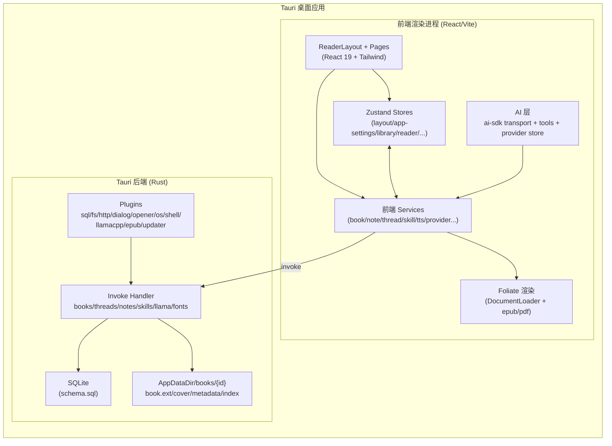
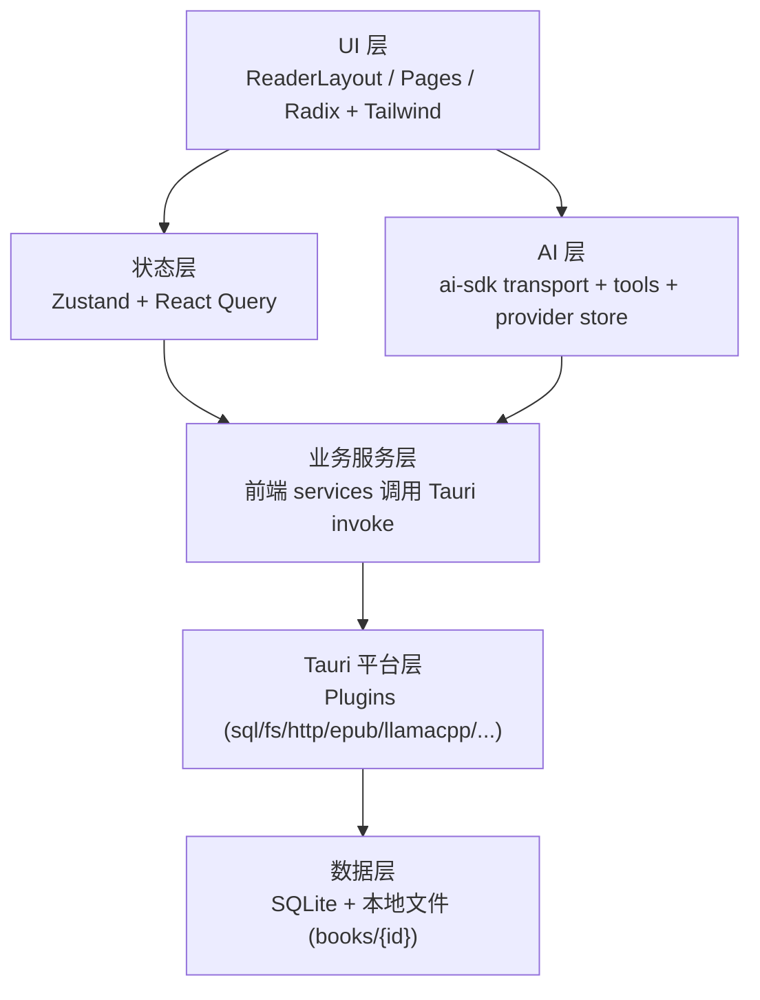
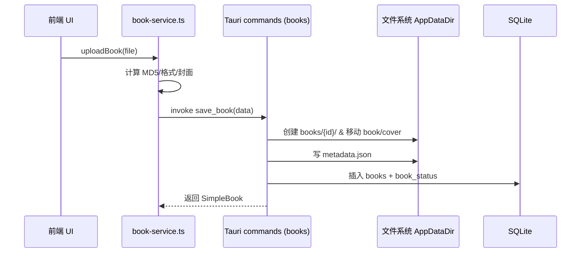
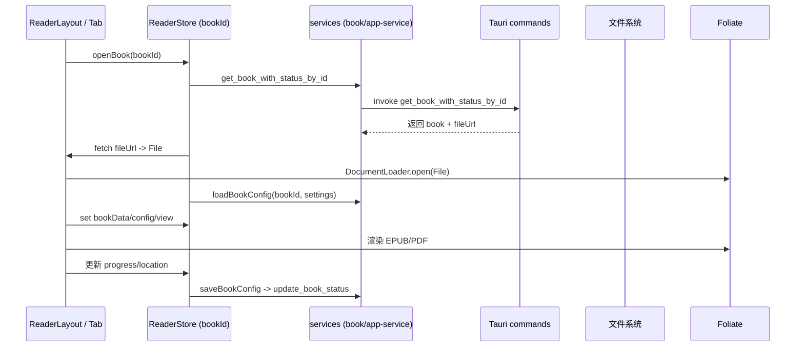
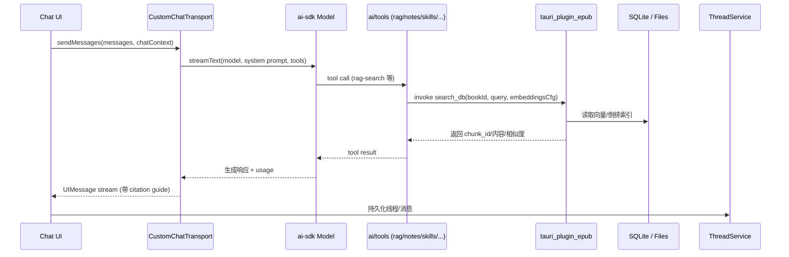
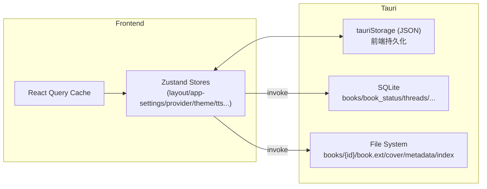

# SageRead 技术设计（基于代码梳理）

> 版本：根据 `sageread` 当前仓库代码整理（前端 React + Tauri 后端）。如有不确定项已在末尾列出，请确认。

## 1. 系统总览
- **形态**：桌面端跨平台（macOS/Windows），Tauri 宿主，前端 React 19 + TypeScript + Vite，样式以 Tailwind 4 + Radix UI 组件为主。
- **多包**：
  - `packages/app`：主应用（UI、业务逻辑、Tauri 配置）。
  - `packages/app-tabs`：可拖拽标签页组件库。
  - `packages/foliate-js`：内置电子书解析/渲染库（EPUB/CBZ/FB2/MOBI）。
- **状态与数据流**：Zustand 管理前端状态（部分持久化到 Tauri fs），异步数据获取用 React Query。持久化数据（书、线程、标注等）用 SQLite（Tauri 插件）。
- **AI 能力**：基于 `ai`/`@ai-sdk/*`，支持多 Provider（OpenAI/Anthropic/Google/DeepSeek/OpenRouter/自定义），RAG 工具链（向量检索+BM25）、技能库、阅读上下文增强。
- **存储**：本地 SQLite（`tauri_plugin_sql`），文件与元数据位于 `AppDataDir/books/{bookId}`，向量索引也在本地。

### 1.1 架构鸟瞰

## 2. 运行时架构与分层
- **宿主**：Tauri `src-tauri`，插件：`sql`、`fs`、`dialog`、`http`、`os`、`shell`、`opener`、`global_shortcut`、`updater`、`llamacpp`、`epub`（自定义向量化/检索）。
- **渲染进程**：React 应用（`packages/app/src/main.tsx`），使用 `HashRouter`、`QueryClientProvider`、`ReaderLayout` 作为顶层布局。
- **布局**：`components/reader-layout.tsx` 管理顶部 Tabs、左右可切换的 Chat/Notepad 侧栏、中间阅读器、设置/通知/窗口控件。
- **模块化**：
  - 页面入口：`src/pages`（library、reader、chat、skills、statistics），但 `ReaderLayout` 作为主容器控制显示。
  - 服务层：`src/services` 封装 Tauri 命令与业务逻辑（书籍、笔记、线程、技能、TTS、AI Provider 等）。
  - 状态层：`src/store` 多个 Zustand store（布局、阅读、设置、书库、Provider、主题、TTS 等）。
  - AI 工具：`src/ai`（Transport、工具集、provider hooks）。

### 2.1 分层视图

## 3. 包/模块细分
### 3.1 `packages/app`
- **入口与配置**：`main.tsx` 创建根节点；`vite.config.ts` 使用 `@tauri-apps` 相关配置；`src-tauri/tauri.conf.json` 定义打包。
- **核心组件**：
  - `components/reader-layout.tsx`：Tab 管理、侧栏显示/拖拽（`re-resizable`）、WindowControls、NotificationDropdown、SettingsDialog。
  - `pages/reader`：阅读器视图（EPUB/PDF），`reader-viewer.tsx` 负责渲染、头/尾栏、标注器。
  - `components/side-chat`、`components/notepad`：与聊天、标注系统联动。
  - `components/settings`：模型/向量/TTS/外观等设置 UI。
  - 其它 UI：markdown 渲染、图标、工具栏、sidebar 等。
- **服务层**：`src/services`
  - `book-service.ts`：书籍 CRUD、上传、格式识别、MD5、封面提取、向量化（调用 `plugin:epub`）、TOC 解析、进度/状态更新。
  - `app-service.ts`：书籍配置加载/保存，合并全局视图设置，写入 `book_status`。
  - `reading-session-service.ts`：阅读会话表 CRUD，计算时长。
  - `note-service.ts` / `book-note-service.ts` / `tag-service.ts`：通用笔记、书内标注、标签 CRUD。
  - `thread-service.ts`：聊天线程存取。
  - `skill-service.ts`：技能库 CRUD、启用切换。
  - `model-service.ts` / `provider-service.ts`：LLM Provider/模型列表获取（使用 Tauri HTTP，兼容 Gemini/OpenAI 等）。
  - `tts-service.ts`：调用阿里 DashScope `qwen3-tts-flash`；支持分片、清洗文本。
  - 其它：字体、transformers、iframe-service、AI tag/context。
- **状态层**：`src/store`
  - `layout-store.ts`：Tab 列表、激活/关闭、创建 ReaderStore、侧栏显隐（持久化）。
  - `reader-store.ts`（封装 `createReaderStore`）：阅读器状态（bookData、config、view/location、progress、sessionStats、当前线程、下拉状态）。
  - `app-settings-store.ts`：系统/全局阅读设置（默认值合并 CJK），设置弹窗开关（持久化）。
  - `library-store.ts`：书库列表/查询缓存、加载状态。
  - `provider-store.ts`：模型 Provider 列表、当前选择模型（持久化）。
  - `theme-store.ts`、`font-store.ts`、`tts-store.ts`、`notification-store.ts`、`llama-store.ts`、`thread-store.ts`、`chat-reader-store.ts`：主题、字体、语音、通知、本地 Llama 能力、线程、聊天上下文等。
- **AI 子系统**：`src/ai`
  - `custom-chat-transport.ts`：封装 ai-sdk Transport，注入 system prompt（`buildReadingPrompt`），选择工具，截取消息上下文，返回 UI 流。
  - `hooks/use-chat.ts`：对外暴露 `useChat`，自动附带 `chatContext` 与 Transport。
  - `tools/*`：RAG 搜索/上下文/目录/范围、书库/笔记/技能/阅读统计、思维导图生成等；RAG 搜索支持 hybrid(vector+BM25)、返回 chunk_id/citation。
  - `providers`：模型 provider 定义、默认值。
- **阅读器实现**：
  - `lib/document.ts`：`DocumentLoader` 支持 PDF/EPUB/CBZ/FB2/FBZ/MOBI 判定与解析，依赖 `foliate-js`；返回 BookDoc（metadata、toc、sections、cover 等）。
  - `pages/reader/components/reader-viewer.tsx`：加载 BookDoc、创建 Foliate viewer、处理屏幕安全区、全局视图设置；PDF 走 `PdfViewer`，其他走 Foliate。
  - `hooks/use-foliate-viewer`（未展开）负责挂载 Foliate 渲染并与 Annotator、Footers 联动。
  - `create-reader-store.ts`：按 bookId 构建 store，`initBook` 通过 Tauri `get_book_with_status_by_id` 取 fileUrl，fetch 文件构造 File → `DocumentLoader.open()`，合并 config，管理 progress/session/error。
  - `hooks/use-reading-session.ts`：监听用户活动/iframe 事件，自动暂停/结束，定时保存，会话数据写入 SQLite `reading_sessions`。
  - `annotator` + `book-note-service.ts`：生成书内标注（CFI/chunk_id/颜色/样式/上下文）。
  - 进度保存：`saveBookConfig` 写入 `book_status` 并调整 library 顺序。
- **其他特性**：TTS、全局主题/字体注入（`mountFontsToMainApp`）、窗口快捷键（Ctrl/Cmd+W 关闭 Tab）、通知/更新检查（Release 模式自动检查）。

### 3.2 `packages/app-tabs`
- 目标：可拖拽标签页组件，暴露 `Tabs`（`TabProperties`），支持拖动/关闭/置顶区域；被 `reader-layout` 用于书籍多 Tab 阅读。

### 3.3 `packages/foliate-js`
- Fork 自 `johnfactotum/foliate-js`，用于电子书解析、CFI、TOC、PDF/EPUB/CBZ/FB2/MOBI 等格式支持。构建脚本 rollup。

## 4. 数据与存储
### 4.1 SQLite Schema（`src-tauri/src/core/schema.sql`）
- **books**：基础信息（id/title/author/format/file_path/cover_path/file_size/language/tags/created_at/updated_at）。
- **book_status**：阅读状态（progress_current/total、location、last_read_at、started_at、completed_at、metadata(vectorization 等)、timestamps）。
- **reading_sessions**：会话维度记录（started_at/ended_at/duration_seconds）。
- **threads**：聊天线程（book_id、metadata、title、messages JSON、timestamps）。
- **notes**：通用笔记（可关联 book_id，存 book_meta）。
- **book_notes**：书内标注/摘录（type、cfi、text、style/color、note、上下文）。
- **tags**：标签库（name/color）。
- **skills**：AI 技能库（name、content Markdown、is_active、is_system）。
- 索引：对标题/时间/状态/书籍外键等建立索引，保证列表/筛选性能。

### 4.2 文件存储
- 根目录：`AppDataDir/books/{bookId}`。
  - `book.{ext}`：原始书籍文件（导入后移动）。
  - `cover.jpg`：封面（若可提取）。
  - `metadata.json`：导入时的元数据。
  - 可能的向量索引/MDBook 转换输出（由 `plugin:epub` 决定，待确认）。
- 临时目录：`tempDir` 在上传阶段存放文件/封面，完成后移动并写库。

### 4.3 前端持久化（非 SQLite）
- `tauriStorage`（封装 Tauri fs）+ `zustand/persist`：存储布局（tabs、侧栏）、全局设置、Provider/选中模型、主题、TTS 配置等。
- React Query：缓存请求结果（如书库刷新）。

## 5. 核心业务流程
### 5.1 书籍导入与管理
1) 前端选择文件 → `uploadBook(file)`：
   - 识别格式（扩展名），校验白名单。
   - 计算 MD5 作为 `bookId`，写入 temp 文件。
   - 尝试解析元数据/封面（EPUB 时用 `DocumentLoader` 提取封面）。
   - 构造 `BookUploadData` 调用 Tauri `save_book`。
2) Tauri 侧 `save_book`：
   - 创建 `books/{id}` 目录，移动文件/封面，写 `metadata.json`。
   - 插入 `books` + 默认 `book_status`。
3) 列表/详情：
   - `getBooksWithStatus`/`get_book_with_status_by_id` → 通过 `convertFileSrc` 返回 fileUrl/coverUrl，供前端直接展示。
4) 进度/状态更新：`updateBookStatus` 写 `book_status`；`saveBookConfig` 在前端同步。
5) TOC/元数据：`parseToc`/`DocumentLoader`；支持 `convertBookToMdbook`（调用 `plugin:epub`）。
6) 删除：`delete_book` Tauri 命令（级联删除 `book_status` 等）。

#### 导入调用链

### 5.2 阅读渲染与交互
1) 打开书籍：`layout-store.openBook` 创建 Tab 和对应 `ReaderStore`。
2) `createReaderStore.initBook`：
   - 通过 `get_book_with_status_by_id` 取得 fileUrl/cover。
   - fetch 文件 → File 对象 → `DocumentLoader.open()` 得到 BookDoc。
   - 合并 `loadBookConfig`（全局视图设置 + book_status/progress/book_notes）。
3) 渲染：
   - `reader-viewer.tsx` 根据格式选择 Foliate 或 PDF Viewer，计算安全区/视图边距。
   - Annotator 负责标注/摘录，Footer/Header 提供翻页、搜索、设置、TTS 入口等。
4) 进度/配置：
   - 翻页/阅读时更新 location/progress，`saveBookConfig` 持久化，`library` 顺序调整（最近阅读置顶）。
5) 阅读会话统计：
   - `use-reading-session` 监听用户/iframe 事件，空闲自动暂停/结束；定时 `updateReadingSession` 写入 `reading_sessions`，结束时 `completeReadingSession`。

#### 打开阅读器调用链

### 5.3 AI 对话与 RAG
1) 模型与 Provider：
   - `provider-store` 存储 Provider 列表（预置 + 自定义），`selectedModel` 作为当前模型；`fetchModelsFromProvider` 用 Tauri HTTP 获取模型列表（兼容 Gemini/OpenAI）。
2) 聊天初始化：
   - `use-chat` 返回 `useChatSDK` 包装，Transport 为 `CustomChatTransport`，自动注入 `chatContext`（当前书、技能、用户设置等）。
3) 消息流转：
   - Transport 处理消息裁剪/引用处理，构造 ai-sdk model 消息，附带 tools。
   - `buildReadingPrompt` 生成 System Prompt（结合书籍上下文/阅读状态）。
4) 工具调用（主要在 `src/ai/tools`）：
   - `rag-search`：混合检索（vector+BM25，动态权重），需要 `getCurrentVectorModelConfig` 返回 embeddings 配置；调用 `plugin:epub|search_db`，返回 `chunk_id`/章节/位置/相似度，附 citation guide。
   - `rag-context`/`rag-range`：按 chunk_id/范围获取原文片段。
   - `rag-toc`：基于章节目录搜索。
   - `getBooks`/`notes`/`getSkills`/`getReadingStats`/`mindmap`：书库、笔记、技能、统计、思维导图生成。
5) 线程存储：`thread-service` 将聊天历史写入 `threads` 表；可按书籍过滤、编辑、删除。

#### AI 调用链（消息 → 工具 → 检索）

### 5.4 标注与笔记
1) 书内标注：`book_notes` 表，字段包含 `cfi/chunk_id`、文本、颜色/样式、上下文；前端 Notepad/Annotator 管理，`updateBooknotes` 更新 config。
2) 通用笔记：`notes` 表，支持附带书籍元信息；前端 Notepad 列表/详情。
3) 标签：`tags` 表，`tag-service` 提供 CRUD；可与笔记/书籍关联（UI 入口待查）。
4) AI 协同：RAG 搜索结果返回 `chunk_id`，聊天指导在回答中引用以便后续标注。

### 5.5 其他功能
- **TTS**：`tts-service.ts` 调用 DashScope（需 API Key），`synthesizeSpeech` 截断 + 分片；配置存 `tts-store`。
- **字体**：`font-service` + Tauri 命令上传/转换 ttf/otf；`mountFontsToMainApp` 注入。
- **主题/外观**：`theme-store` 控制暗色、侧栏互换；全局设置影响阅读视图（行距、字体、分页/滚动等）。
- **窗口与快捷键**：Windows 无边框；全局捕获 Cmd/Ctrl+W 关闭当前 Tab；Resize 时显示遮罩避免闪烁。
- **更新**：Release 模式启动时自动检查更新（`tauri_plugin_updater`）。

### 5.6 状态持久化视图

## 6. 后端（Tauri）实现要点
- **入口**：`src-tauri/src/lib.rs` 注册所有命令，初始化插件，启动数据库连接池，处理窗口事件（关闭时清理 Llama 进程）。
- **模块**：
  - `books`：`commands.rs`/`models.rs` 处理导入、查询、状态更新、删除；文件移动至 AppDataDir。
  - `threads`：聊天线程 CRUD。
  - `notes`/`book_notes`/`tags`：笔记/标注/标签 CRUD。
  - `skills`：技能库 CRUD，加载默认技能（`default-skills.json`）。
  - `fonts`：字体上传/转换。
  - `llama`：本地模型下载/删除、llama server 路径。
  - `database.rs`：初始化 SQLite，执行 `schema.sql`。
  - `state.rs`：全局 `AppState` 存储 `SqlitePool`。
- **自定义插件**：`tauri_plugin_epub`（仓库中未展开实现）负责：
  - `index_epub`：向量化/索引构建。
  - `search_db`：混合/向量/BM25 检索。
  - `parse_toc`、`convert_to_mdbook` 等。

## 7. 构建与运行
- 前端：在 `packages/app` 目录下 `pnpm dev`（Vite），`pnpm build`（tsc+vite）。
- 桌面应用：`pnpm tauri dev` / `pnpm tauri build`。
- 子包：`packages/app-tabs` 可 `pnpm dev`（tsc --watch）；`packages/foliate-js` 用 `npm run build`（rollup）如需。

## 8. 重要交互/数据流示例
- **打开书籍**：`openBook` → 创建 Tab/ReaderStore → `initBook` 拉取 fileUrl → fetch → `DocumentLoader.open` → 设置 `bookData/config` → `ReaderViewer` 渲染。
- **进度保存**：阅读交互 → 更新 progress/location → `saveBookConfig` → `update_book_status`（SQLite） → `library` 重排。
- **阅读会话统计**：可见 Tab 时启动 `use-reading-session` → 监听活动/空闲 → 定时 `updateReadingSession`，空闲超时自动 `completeReadingSession`。
- **RAG 检索**：AI 调用 `rag-search` → `plugin:epub|search_db`（vector/bm25/hybrid） → 返回 chunk_id/相似度/章节 → AI 按 citation guide 回答。
- **TTS**：用户触发朗读 → `synthesizeSpeech` 清洗/截断文本 → Tauri HTTP 调 DashScope → 返回音频 URL。

## 9. 待确认/潜在风险
1) **向量插件实现细节缺失**：`tauri_plugin_epub` 的索引存储位置、向量模型部署（本地 vs 远端）、依赖二进制/服务是否已打包？需确认。
2) **TTS 可配置性**：当前固定阿里 DashScope；是否需要抽象多 Provider/自托管 TTS。
3) **技能默认值**：`src-tauri/src/core/default-skills.json` 是否需在线更新/同步？更新策略？
4) **文件清理**：删除书籍时本地向量索引/临时文件是否同步清理（插件实现未见）；需确认。
5) **移动端/多窗口计划**：当前单窗口 `HashRouter`；如扩展需评估状态共享。
6) **安全性**：API Key 存储在本地（tauriStorage/SQLite），需确认加密需求；模型列表请求使用 Tauri HTTP，错误处理已覆盖但无重试策略。

---

> 如需补充具体流程图/时序图，或展开某模块（例如 `tauri_plugin_epub` 内部设计、向量化参数、UI 交互细节），请告知。 
